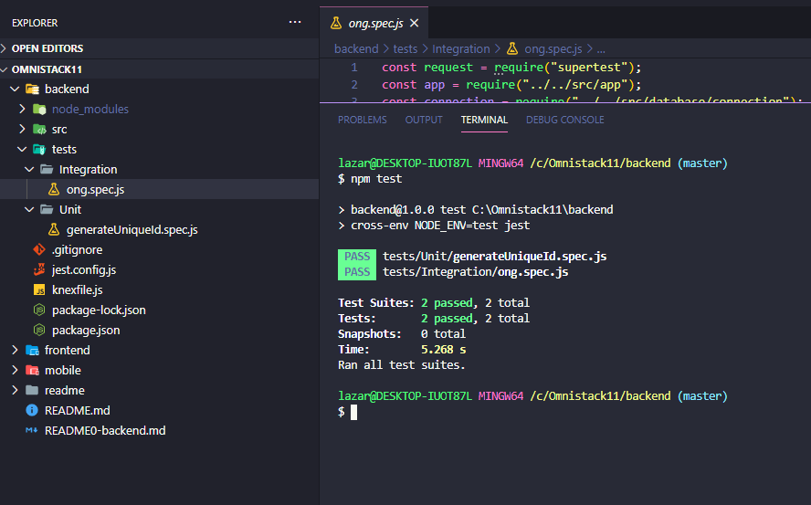

<h1 align="center">
Omnistack 11 :rocket:  
   
   

</h1>
  
  

<h2> O que é ? <h3> Aplicação para conectar ONGs e outras instituições a pessoas que tem disponibilidade para ajudar</h3> </h2>

# Sobre o projeto :mag:
Uma aplicação para cadastrar ONG's onde essas podem cadastrar os casos que estão precisando de doação. O usuário têm acesso a um aplicativo onde pode enviar um email ou uma mensagem por whatssap à respectiva ONG e seu caso. Essa aplicação vem para consolidar os aprendizados com uma stack poderozíssima que é a do React. Tudo isso nos faz ter o poder de construir uma aplicação para web e mobile, com comunicação em tempo real e consumindo o mesmo banco de dados SQL.
  
<h4> 
  Linguagem -> Javascript 
   
  Ambiente do Back-end :open_file_folder: -> Node para o servidor   e SQLITE para banco de dados -  :cupid: 
   
  Ambiente Front-end -> React
   
 Ambiente Mobile ->  React Native
   
</h4>

## Telas 

  <b>Aplicação WEB</b>
   
    
    
    
    

  <b>Apliação Mobile</b>
   
    
    
     

<h3 align="center">Implementações no Back end </h3>
<h4 align="center"> Testes com Jest e Supertest </h4>

    
    
    

  <h4 align="center"> Segments pra tratar dados inválidos </h4>

    

                                                                    
# Principais aprendizados :bow:
* SPA
* Rotas
* Desenvolver mobile/web com o React
* Servidor com node 
* Knex e Migrations no banco de dados
* Testes com Supertest e o Jest
* Celebrate pra tratativa de exceções no backend

## Visite minhas anotações :point_down: no Notion onde contém boa parte do que eu fiz e dá pra notar a evolução das anotações de acordo com os dias que passaram.
<https://www.notion.so/Semana-omnistack11-85d8607213f346eaa1536f1985e31800>

# Tecnologias e frameworks utilizadas em cada ambiente
## Back end :package:	
- Node  
- Knex
- Nodemon
- Supertest
- Jest
- SQLite3
- Cors 
- Celebrate
- Software Insomnia
## Front end :memo:
- Node
- React
- Axios
- React-router-dom
- React-icons
- Font awesome
## Mobile :iphone:	
- Node
- React Native
- Expo
- Axios
- Intl (conversão de moedas)
- react-navigation
- react-dom
- expo-mail-composer

# Como executar o projeto
## Clonar o repositório na sua máquina.
### Executar no terminal para as pastas frontend/mobile/backend
~~~javascript
npm install node
~~~
### Em seguida startar a aplicação no terminal
#### Siga para a pasta frontend cd ./frontend e digite 
~~~ javascript
npm start
~~~~
O mesmo acima para cd ../backend 
### Requisitos para rodar a versão mobile
* Baixar o Expo na playstore
##### Executar o seguinte comando na pasta cd ../mobile
~~~javascript
npm start
~~~
#### Próximo passo
##### Escanear o QR CODE que será gerado e automaticamente a aplicação ficara online desde que o backend e o mobile esteja inicializado.

### Instrutor: O própio CTO da [Rocketseat](https://rocketseat.com.br/) :rocket: Diego

# Autor
Lazaro Jose da Silva de Souza  
Estudante de Análise e Desenvolvimento de Sistemas pela UNINABUCO na modalidade EAD 
Entusiasta na arte de aprender algo do zero 
https://www.linkedin.com/in/lazarok09
## Aprenda a usar o [markdown](https://docs.pipz.com/central-de-ajuda/learning-center/guia-basico-de-markdown#open) no seu GitHub
## Use [emojis](https://github.com/ikatyang/emoji-cheat-sheet) no seu readme :P

< / :heart: >

